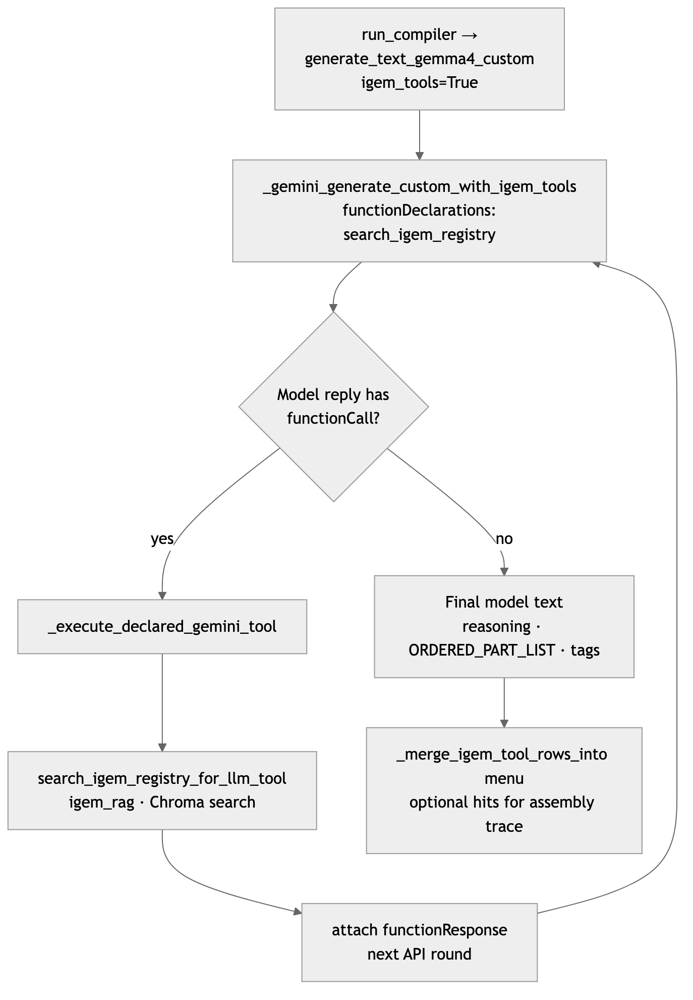
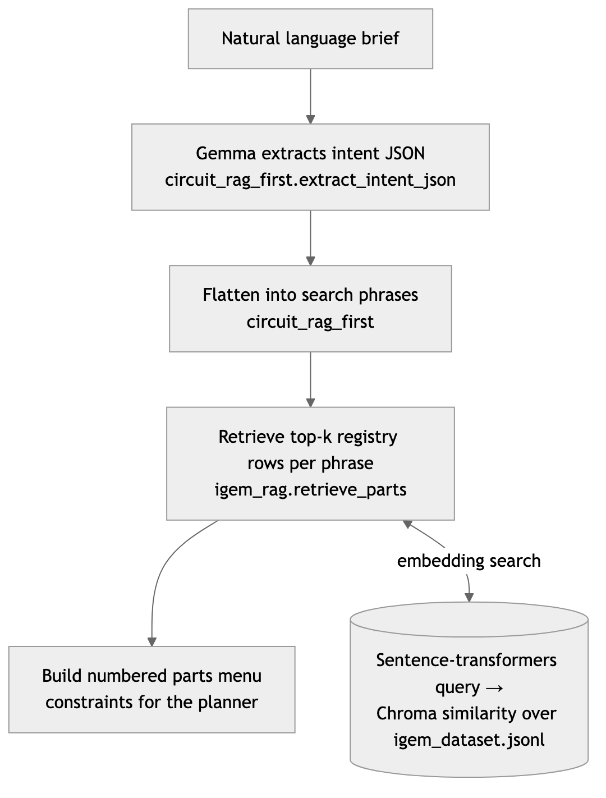

# OpenGeneEdit

## Demo (recommended)

For quick evaluation, sharing, or whenever you want **reliable speed** without tuning GPUs or downloading weights, use the hosted deployment:

**[https://opengene.up.railway.app/](https://opengene.up.railway.app/)**

That build runs **hosted Gemma 4** (Google AI / `gemma-4-31b-it`). Everything below is optional for developers who want **local** quantized inference.

---

## Documentation and reproducibility bundle

This repository includes a complete documentation and reproducibility bundle aligned to common model handoff expectations.

| Deliverable | Location |
|---------------|----------|
| **Model summary (A1–A9)** — export to **PDF/Word** when a non-Markdown deliverable is required | [`docs/MODEL_SUMMARY.md`](docs/MODEL_SUMMARY.md) |
| **Path contract (B6)** — single source of truth for data/model/output dirs | [`SETTINGS.json`](SETTINGS.json) (applied by [`submission_settings.py`](submission_settings.py)) |
| **Entry-point commands (B8)** | [`entry_points.md`](entry_points.md) |
| **Pinned dependencies (B4)** | [`requirements.txt`](requirements.txt) |
| **Directory tree (B5)** — regenerate after changes: `find . -type d \| LC_ALL=C sort > directory_structure.txt` | [`directory_structure.txt`](directory_structure.txt) |
| **Extra config notes (B3)** | [`config/README.md`](config/README.md) |
| **Top-level scripts** | [`prepare_data.py`](prepare_data.py), [`train.py`](train.py), [`predict.py`](predict.py) |

**Hardware / OS reproduction checklist:** document CPU model, core count, RAM, GPU model(s) and VRAM, **OS + version** (e.g. macOS 14.x, Ubuntu 22.04), and **Python** version (see [`runtime.txt`](runtime.txt) for deploy pin). **Trained weights:** default inference uses **hosted** Gemma or a **downloaded GGUF**; optional LoRA merge artifacts belong under **`MODEL_DIR`** in `SETTINGS.json` (see **§B7** in `docs/MODEL_SUMMARY.md` — large files are **gitignored**; include them in your release archive or provide a Hugging Face link).

---

## Local hardware requirements

The OpenGeneEdit fine-tune ships as a **~31B quantized GGUF**. The common **`dgene-q4km.gguf`** (Q4_K_M) file is about **17 GiB on disk**; at runtime you also need **KV cache, Metal/CUDA buffers, and often multiple parallel slots** in tools like LM Studio. Expect:

| What you have | What usually happens |
|---------------|----------------------|
| **Smooth local GPU** | Roughly **≥24 GB** unified memory (Apple Silicon) or **≥24 GB VRAM** (desktop GPU) so weights **plus** KV fit without **`Insufficient Memory` / `llama_decode -3`**. Use **[LM Studio](https://lmstudio.ai)** with **`DGENE_LOCAL_HTTP_URL`** (see below), or a **smaller quant** from [Hugging Face](https://huggingface.co/davidgeorge25/opengenedit-gemma-4-31b) (e.g. Q3_K_M / Q2_K). |
| **16 GB machines** | Full GPU offload of Q4_K_M often **does not fit**; LM Studio may log Metal **out-of-memory** during warmup. Mitigations: **fewer GPU layers**, **`n_ctx` 2048 or lower**, **`n_parallel` / slots = 1**, or **CPU** (very slow). In-process **`llama-cpp-python`** on macOS can also hit Gemma 4 + Metal edge cases even when memory is tight. |
| **CPU-only** | Can run but **compile steps take many minutes** on ~31B; heartbeats and **`DGENE_COMPILE_MODE=legacy`** help; hosted demo or API key is faster. |

**Summary:** treat **local GGUF** as an advanced path. For most usage, **prefer [the Railway app](https://opengene.up.railway.app/)** or a **`GEMINI_API_KEY`** / **`GOOGLE_API_KEY`** local setup without downloading the full quant.

---

## Local Gemma 4 (read first)

OpenGeneEdit supports **two local backends**. **macOS users should prefer the HTTP one** — it sidesteps a real `llama-cpp-python` 0.3.x Metal bug for Gemma 4 SWA decoding.

### Recommended: LM Studio HTTP (works on Metal today)

1. Install **[LM Studio](https://lmstudio.ai)** and open it.
2. Load **`davidgeorge25/opengenedit-gemma-4-31b`** (start with a quant that fits your RAM — see **Local hardware requirements** above; Q4_K_M needs ~24 GB+ headroom for comfortable GPU offload).
3. Open the **Local Server** tab → **Start Server** (default `http://127.0.0.1:1234`).
4. In **`.env`**:

   ```bash
   DGENE_LOCAL_HTTP_URL=http://127.0.0.1:1234/v1
   DGENE_LOCAL_HTTP_MODEL=dgene-v1-q4
   DGENE_INFERENCE=local_http
   ```

5. **`python3 server.py`** — boot prints `[inference] LocalHTTPBackend url=… model=…`. The same compile UI now POSTs to LM Studio's OpenAI-compatible **`/v1/chat/completions`** and **`/v1/completions`** endpoints. Metal works because LM Studio bundles its own up-to-date llama.cpp.

### Fallback: in-process llama-cpp-python (`DGENE_GGUF_PATH`)

Used when `DGENE_LOCAL_HTTP_URL` is unset and `DGENE_INFERENCE` is `auto` or `gguf`. **GPU offload is only read from `DGENE_GGUF_GPU_LAYERS`.** A `.env` line like **`n_gpu_layers=-1`** does nothing — that key is never consulted; use **`DGENE_GGUF_GPU_LAYERS=-1`** for full offload.

| Platform | When **`DGENE_GGUF_GPU_LAYERS`** is **unset** (in-process fallback) |
|----------|---------------------------------------------------------------------|
| **macOS** | **`n_gpu_layers=0` (CPU)** — avoids common Gemma 4 SWA + Metal **`llama_decode -3`** failures |
| **Linux** | **`n_gpu_layers=-1`** (GPU when available) |

After startup, stderr prints **`[inference] GGUF load …`** with the resolved **`n_gpu_layers`**, **`n_batch`**, **`n_ubatch`**, **`swa_full`**, **`offload_kqv`**, **`flash_attn`**. On macOS with Metal offload, defaults favor stability (**`swa_full` off**, **`offload_kqv` on**, smaller batch/ubatch) unless overridden — see **[`.env.example`](.env.example)** (`DGENE_GGUF_CTX`, **`DGENE_GGUF_N_BATCH`**, **`DGENE_GGUF_N_UBATCH`**, **`DGENE_GGUF_SWA_FULL`**, **`DGENE_GGUF_OFFLOAD_KQV`**, **`DGENE_GGUF_FLASH_ATTN`**).

**Auto-retry on `llama_decode -3`.** When a decode raises this error, OpenGeneEdit automatically rebuilds the llama.cpp instance with the next safer profile and retries the same call: **flip `flash_attn`** → **`swa_full=True` + large batch** → **`swa_full` + `flash_attn`** → **smaller `n_batch`/`n_ubatch`** → **smaller `n_ctx`** → **partial GPU (`n_gpu_layers=20`)** → **CPU baseline**. Each rebuild prints **`[inference] GGUF rebuild …`** so you can see the active profile. Disable via **`DGENE_GGUF_AUTO_RETRY=0`**.

**Compile-mode default depends on the backend.** Hosted Gemma defaults to **`circuit_synth`** (JSON-heavy hybrid pipeline). The local GGUF fine-tune defaults to **`legacy`** instead — the **`<|channel>thought` … `</circuit>`** path it was actually trained on, with much shorter prompts than `circuit_synth`. If GGUF on CPU still feels slow, this default keeps it usable; force JSON paths explicitly with **`DGENE_COMPILE_MODE=circuit_synth`** or **`DGENE_COMPILE_MODE=rag_first`**.

On CPU, ~31B GGUF steps can take many minutes; **`DGENE_GGUF_HEARTBEAT_SEC`** (default **15**) emits **`compile_progress`** heartbeats so the UI does not look frozen.

---

## Gemma 4 implementation details

Trace **hosted Gemma 4** and **optional local GGUF** in **[`inference.py`](inference.py)**:

| Entry point | Role |
|-------------|------|
| **`generate_text_gemma4`** / **`generate_text_gemma4_custom`** | Same Google API **or**, when **`get_backend()`** is GGUF, **local `complete_chat`** (intent JSON, RAG-first compiler, training-data scripts). Compiler **`search_igem_registry`** tool rounds stay **hosted-only**. |
| **`_gemini_generate_custom_with_igem_tools`** | Multi-turn **`functionCall`** / **`functionResponse`** with **`search_igem_registry`** (**hosted API only**; skipped on GGUF). |
| **`get_backend`** → **`run_inference`** | Resolves **`DGENE_INFERENCE`** (`auto` chooses Gemini vs **`llama-cpp-python`** when **`DGENE_GGUF_PATH`** is set). |
| **`parse_thought_and_sequence`** | Parses channel-tagged model output (`<|channel>thought` … `</circuit>`) used in legacy and training formats. |

Supervised JSONL for external SFT / LoRA → GGUF: **[`scripts/generate_gemma_train.py`](scripts/generate_gemma_train.py)** (same **`generate_text_gemma4`** API path as the live compiler).

**Architecture & APIs:** [`docs/HACKATHON_TECHNICAL.md`](docs/HACKATHON_TECHNICAL.md) · [`docs/ARCHITECTURE.md`](docs/ARCHITECTURE.md)

### Default: hosted API vs local GGUF (`llama-cpp-python` / llama.cpp)

- **`DGENE_INFERENCE`** defaults to **`auto`**. If **`GEMINI_API_KEY`** or **`GOOGLE_API_KEY`** is set, **`auto`** uses the **Google Generative Language API** (hosted Gemma 4 over HTTPS). If **no** API key is set but **`DGENE_GGUF_PATH`** points at a valid **`.gguf`**, **`auto`** uses **[`llama-cpp-python`](https://github.com/abetlen/llama-cpp-python)** — Python bindings that load **llama.cpp** and run inference **in-process** inside `server.py`.
- **`DGENE_INFERENCE=gguf`** forces **local llama.cpp** inference even when API keys exist on the machine.
- **`DGENE_INFERENCE=gemini`** (aliases: **`hosted`**, **`google`**, **`api`**) forces the **hosted API only**.

**Summary:** out of the box, clones with API keys **default to the cloud API**; users who set **`DGENE_GGUF_PATH`** and **`DGENE_INFERENCE=gguf`** (or use **`auto`** without keys) run the **same pipelines on llama.cpp** via **`llama-cpp-python`**. This repo does **not** spawn the **`llama-server`** binary — it embeds llama.cpp through **`llama-cpp-python`** only.

---

## Quick start: fine-tuned model only (no Gemini API)

Use the OpenGeneEdit **GGUF** on Hugging Face instead of `GEMINI_API_KEY`. Steps:

1. **Download the weights**  
   Open **[davidgeorge25/opengenedit-gemma-4-31b](https://huggingface.co/davidgeorge25/opengenedit-gemma-4-31b)** → **Files and versions** → download **`dgene-q4km.gguf`** (Q4_K_M, based on `google/gemma-4-31B-it`).

2. **Install Python deps** (repo root)

   ```bash
   python3 -m pip install -r requirements.txt
   python3 -m pip install llama-cpp-python
   ```

3. **Create `.env`** next to `server.py` with:

   ```bash
   DGENE_GGUF_PATH=/absolute/path/to/dgene-q4km.gguf
   DGENE_INFERENCE=gguf
   DGENE_COMPILE_MODE=legacy
   ```

   - **`DGENE_INFERENCE=gguf`** forces **`llama-cpp-python`** (llama.cpp in-process) even if a Gemini/Google API key exists elsewhere on your machine.  
   - **`DGENE_COMPILE_MODE=circuit_synth`** (default) or **`rag_first`** can run on GGUF too (`generate_text_gemma4*` uses the local model). Mid-compile **`search_igem_registry`** **`functionCall`** loops remain **hosted-only** and are skipped locally.  
   - **`DGENE_COMPILE_MODE=legacy`** is the classic channel-tagged DNA path (`<|channel>thought` … `</circuit>`) plus **`apply_rag_substitution`** — closer to the fine-tune’s training format.

4. **Start the compiler UI**

   ```bash
   python3 server.py
   ```

   Open the printed URL (often **`http://127.0.0.1:8765/`**).

**Hardware.** See **[Local GGUF: GPU layers](#local-gguf-gpu-layers-read-first)** — **`DGENE_GGUF_GPU_LAYERS`** naming, macOS vs Linux defaults, Metal tuning, and CPU heartbeats. **31B** weights need ample RAM/VRAM; upgrade **`llama-cpp-python`** if Gemma 4 + Metal misbehaves on your build.

### Same GGUF with upstream llama.cpp (`llama-server` / `llama-cli`)

The file **`dgene-q4km.gguf`** you downloaded is a standard **GGUF** — it is the same artifact **[llama.cpp](https://github.com/ggerganov/llama.cpp)** loads. You can host it locally **without Python**:

```bash
# Install llama.cpp (pick one): brew, winget, or a release binary from the llama.cpp repo
# Then, using your downloaded file:
llama-server -m /absolute/path/to/dgene-q4km.gguf

# Or let llama.cpp fetch from Hugging Face (same repo / weights as above):
llama-server -hf davidgeorge25/opengenedit-gemma-4-31b
```

Use a **recent** llama.cpp build so **Gemma 4** is supported. The terminal prints a **local URL** (often with a small web UI and an OpenAI-compatible HTTP API) for chatting or testing the fine-tune outside OpenGeneEdit.

**OpenGeneEdit compiler:** `python3 server.py` uses **`llama-cpp-python`** (llama.cpp under the hood) with **`DGENE_GGUF_PATH`** — it loads that **same `.gguf` in-process**. It does **not** call `llama-server` today; use **`DGENE_GGUF_PATH` + `DGENE_INFERENCE=gguf`** for compiles in the web UI, and use **`llama-server`** separately if you want a standalone local host for the identical weights.

---

**OpenGeneEdit** is a synthetic-biology–oriented DNA “compiler”: you describe a genetic circuit in natural language and get structured reasoning, candidate sequences, iGEM-aware retrieval and audits, heuristic compiler passes, multi-objective ranking (including a Pareto-style front), plasmid visualization, and FASTA / GenBank export.

**Full technical reference (architecture, RAG, APIs, env vars, limitations):** [`docs/HACKATHON_TECHNICAL.md`](docs/HACKATHON_TECHNICAL.md)

**Naming.** Product branding is **OpenGeneEdit**. Stderr tags use **`oge`** (e.g. `[oge/server]`). Configuration keys keep the **`DGENE_*`** prefix so existing `.env` files stay valid.

---

## Architecture summary

Inference is **Google Gemma 4 only**: **Gemini API** (stdlib `urllib` in `inference.py`) or local **GGUF** via [`llama-cpp-python`](https://github.com/abetlen/llama-cpp-python). **`generate_text_gemma4`** / **`generate_text_gemma4_custom`** follow whichever backend **`get_backend()`** selects, so **circuit_synth** / **rag_first** can run entirely on GGUF when **`DGENE_INFERENCE=gguf`** (no API key). Mid-compile **`search_igem_registry`** tool loops remain **hosted-only**; GGUF uses the initial retrieval menu only. **`/api/fix`** and **`expert_review`** use the same text-completion path and therefore work on GGUF too.

### Architecture diagrams

**Tool calling** — compile path with `search_igem_registry`, declared Gemini tools, Chroma-backed hits, and iterative `functionResponse` rounds until the model returns final reasoning (`ORDERED_PART_LIST`, etc.):



**RAG retrieval** — natural-language brief → intent JSON (`circuit_rag_first.extract_intent_json`) → search phrases → `igem_rag.retrieve_parts` / embedding search over **`data/igem_dataset.jsonl`** (sentence-transformers + Chroma) → numbered parts menu for the planner:



**End-to-end pipeline** — deploy surface, HTTP APIs, compile modes (hybrid / RAG-first / legacy), inference backends, iGEM RAG, passes, and ranking in one diagram. The SVG is wide; it is scaled here for the README. Open the file directly for full detail or zoom.



Source (Mermaid): [`docs/diagrams/full_app_pipeline.mmd`](docs/diagrams/full_app_pipeline.mmd) · also described in [`docs/ARCHITECTURE.md`](docs/ARCHITECTURE.md).

### Compile modes (`DGENE_COMPILE_MODE`)

| Mode | Behaviour |
|------|-----------|
| **`circuit_synth`** (default) | **Hybrid:** Gemma extracts boolean **`circuit_intent`** JSON → when **`applicable`**, **`circuit_ir`** + **`circuit_synth`** + **`circuit_verify`** emit a **truth-table-checked** linear plasmid (`rag.pipeline === circuit_synth`). Remaining slots use **RAG-first** (shared biological intent JSON + Chroma menu + Gemma **`ORDERED_PART_LIST`** compiler). Optional **`slot_template`** cassette may lead RAG-first variants when **`gate` / `input_analytes` / `reporter`** parse. |
| **`rag_first`** | Intent JSON → **`build_part_menu`** → menu-constrained compiler → **`assemble_sequence`** (registry DNA only). |
| **`legacy`** | Gemma emits `<|channel>thought` + DNA + `</circuit>` → **`parse_thought_and_sequence`** → **`apply_rag_substitution`** (equal-chunk slots + Chroma + optional **NCBI Gene**). |

If **`circuit_synth`** or **`rag_first`** is selected but neither **`GEMINI_API_KEY` / `GOOGLE_API_KEY`** nor a usable **GGUF** backend is configured (`hosted_generation_ready` / `rag_first_configured`), **`server.py` falls back to legacy** and logs a warning.

### iGEM data & RAG

- **Corpus:** [`data/igem_dataset.jsonl`](data/igem_dataset.jsonl) (from [`scripts/extract_igem_dataset.py`](scripts/extract_igem_dataset.py) + optional [`data/xml_parts.xml.gz`](data/xml_parts.xml.gz)).
- **Embeddings:** ChromaDB + **`sentence-transformers`** (`all-MiniLM-L6-v2`), persisted under **`DGENE_CHROMA_PATH`** (default `.chroma_igem`).
- **Two retrieval paths:** (1) **Legacy post-hoc** **`apply_rag_substitution`** — proportional chunks + similarity (**promoters** use **`DGENE_RAG_MIN_SIM_PROMOTER`** vs **`DGENE_RAG_MIN_SIM`**). (2) **RAG-first** — retrieve **before** the compiler; DNA from menu/`ORDERED_PART_LIST` only (details in §5–5.10 of the technical doc).
- **NCBI fallback:** **`ncbi_gene.py`** (Entrez) for CDS-shaped symbols when iGEM does not verify; promoter slots default **`DGENE_NCBI_PROMOTER_SLOTS=0`**.

### Passes, ranking, QA

- **`passes.py`** — ORF, GC, repeats, Type IIS, restriction map, E. coli CAI, RBS heuristic, hairpins, etc.
- **`ranker.py`** — Four objectives + **Pareto**; default **`best_id`** order: **`pipeline_tier`** (`circuit_synth` > `slot_template` > `rag_first` > legacy) → **`prompt_alignment`** → **composite** (weights in **`ranker.WEIGHTS`**).
- **`design_expert_lint.py`** — Promoter ↔ cognate regulator rules on ordered **`BBa_`** lists → **`rag.expert_lint`**.
- **`expert_review.py`** — Optional second Gemma pass when **`DGENE_EXPERT_REVIEW=1`** → **`rag.expert_review`**.
- **Snapshots:** **`GET /api/snapshot?id=…`** when **`DGENE_SNAPSHOTS`** enabled (`.design_snapshots/`, gitignored).

### Web compiler (`server.py` + `web/`)

- **Not Flask/FastAPI** — **`ThreadingHTTPServer`** serves **`/`** → `web/index.html`, **`/css/*`**, **`/js/*`**, other static assets under `web/`, plus **`/api/*`** on the **same origin**.
- **Endpoints:** `POST /api/compile` (sync or **`progress: true`** → **`202`** + poll **`/api/compile/status`**), **`GET /api/health`**, **`POST /api/fix`**, **`GET /api/snapshot`**, CORS headers on responses.
- **`PORT`:** If **`PORT`** is set (Railway, etc.), the server binds **only** that port. If **unset**, local default **`8765`** with fallback to the next free port.

### Streamlit (`app.py`)

**Legacy path only** — single **`run_inference`** + **`apply_rag_substitution`** + Bokeh map. Does **not** run **`circuit_pipeline`** / **`circuit_rag_first`**. Use **`python3 server.py`** for topology or menu compilers.

### Fine-tuning helper

[`scripts/generate_gemma_train.py`](scripts/generate_gemma_train.py) builds **[`data/gemma_train.jsonl`](data/gemma_train.jsonl)** from **`data/igem_dataset.jsonl`** for external SFT/LoRA → GGUF workflows (see technical doc §3).

```bash
python3 scripts/extract_igem_dataset.py   # data/xml_parts.xml.gz → data/igem_dataset.jsonl
python3 scripts/generate_gemma_train.py    # hosted Gemma 4 → data/gemma_train.jsonl (needs API key)
```

---

## Requirements

- **Python 3.10+** recommended (Streamlit/Bokeh path); **`runtime.txt`** pins **3.11.8** for Railway/Nixpacks.

Install RAG / embedding dependencies for the full **`server.py`** pipeline:

```bash
python3 -m pip install -r requirements.txt
```

| Goal | Packages |
|------|----------|
| Web compiler (`server.py`) | `requirements.txt` (Chroma + sentence-transformers; pulls large transitive deps e.g. **torch** — plan **~2 GB+ RAM** for first embed index) |
| Streamlit (`app.py`) | `streamlit`, `bokeh`, `pandas`, `dna-features-viewer` |
| Hosted Gemma | API key only (no Gemini SDK; **`urllib`** in `inference.py`) |
| Local GGUF | `llama-cpp-python` for your platform |

```bash
python3 -m pip install streamlit bokeh pandas dna-features-viewer
```

---

## Configuration

Create **`.env`** at the repo root (optional; loaded in `inference.py`, **does not override** existing environment variables). See **[`.env.example`](.env.example)** and **§10 of [`docs/HACKATHON_TECHNICAL.md`](docs/HACKATHON_TECHNICAL.md)** for the full variable list (`DGENE_COMPILE_MODE`, RAG-first knobs, slot-template, NCBI, snapshots, streaming, etc.).

**Minimum for hosted demo:** `GEMINI_API_KEY` or `GOOGLE_API_KEY`, and usually `DGENE_GEMINI_MODEL` (e.g. `gemma-4-31b-it`).

Restart **`server.py`** after changing `.env`.

---

## Running

**Compiler server (recommended — full pipeline + static UI)**

```bash
python3 server.py
```

When **`PORT` is unset**, opens at **`http://127.0.0.1:8765/`** (or next free port). When **`PORT` is set**, listens on **`0.0.0.0:PORT`** only.

### Railway deployment

Ships **`Procfile`**, **`railway.toml`**, **`nixpacks.toml`**, and **`runtime.txt`**. Connect the GitHub repo and set **`GEMINI_API_KEY`** / **`GOOGLE_API_KEY`** (and optional **`DGENE_GEMINI_MODEL`**) in Railway Variables.

- **Process:** `python server.py` (**not** `app.py` / Streamlit — Nixpacks otherwise auto-starts `app.py`). If logs show `ModuleNotFoundError: streamlit`, open **Service → Settings → Deploy → Custom Start Command** and set **`python server.py`**.
- **Stack:** stdlib HTTP (**not** gunicorn — not WSGI).
- **Health check:** `GET /api/health`
- **RAM:** Prefer **≥ 2 GB**; first Chroma index build is heavy.
- **Disk:** `.chroma_igem/` and snapshots are **ephemeral** across redeploys — first compile after deploy may be slower.

Public URL: **`https://<service>.up.railway.app/`** serves both **`/`** and **`/api/*`**.

### Streamlit playground

```bash
streamlit run app.py
```

---

## Repository layout

| Path | Role |
|------|------|
| [`server.py`](server.py) | `ThreadingHTTPServer`, static `web/`, `/api/*` |
| [`web/`](web/) | Compiler UI (map, candidates, RAG audit, exports) |
| [`inference.py`](inference.py) | Gemma 4 backends, parsing, `.env` load |
| [`igem_rag.py`](igem_rag.py) | Chroma index, retrieval, legacy substitution, menu retrieval |
| [`ncbi_gene.py`](ncbi_gene.py) | NCBI Entrez CDS fallback + cache |
| [`circuit_ir.py`](circuit_ir.py) … [`circuit_pipeline.py`](circuit_pipeline.py) | IR, intent, parts catalog, synthesis, verification, hybrid orchestration |
| [`circuit_rag_first.py`](circuit_rag_first.py), [`slot_template_compile.py`](slot_template_compile.py) | RAG-first menu compiler + optional slot-template cassette |
| [`design_expert_lint.py`](design_expert_lint.py), [`expert_review.py`](expert_review.py) | Regulatory lint + optional Gemma reviewer |
| [`passes.py`](passes.py), [`ranker.py`](ranker.py) | Diagnostics + Pareto / ranking |
| [`app.py`](app.py) | Streamlit legacy playground |
| [`data/igem_dataset.jsonl`](data/igem_dataset.jsonl), [`data/gemma_train.jsonl`](data/gemma_train.jsonl), [`data/xml_parts.xml.gz`](data/xml_parts.xml.gz) | Registry corpus, optional training JSONL, optional raw iGEM XML export |
| [`scripts/extract_igem_dataset.py`](scripts/extract_igem_dataset.py), [`scripts/generate_gemma_train.py`](scripts/generate_gemma_train.py) | Dataset / Gemma 4 training JSONL builders |
| [`docs/HACKATHON_TECHNICAL.md`](docs/HACKATHON_TECHNICAL.md), [`docs/ARCHITECTURE.md`](docs/ARCHITECTURE.md), [`docs/diagrams/`](docs/diagrams/) | Technical spec, architecture write-up, diagram sources + renders |
| [`railway.toml`](railway.toml), [`nixpacks.toml`](nixpacks.toml), [`Procfile`](Procfile), [`runtime.txt`](runtime.txt) | Railway / Nixpacks deploy hints |

Gitignored / generated: `.chroma_igem/`, `.design_snapshots/`, `finetune_results/`, etc.

---

## Limitations

Outputs are **not** wet-lab validated. Legacy RAG uses **similarity and proportional chunks** — treat map **`*`** markers and **`rag.parts`** as cues. **Slot-template** does not replace **`circuit_verify`** truth-table proofs unless **`circuit_synth`** also applies. See **§11** in [`docs/HACKATHON_TECHNICAL.md`](docs/HACKATHON_TECHNICAL.md).

---

## License / data

Use of the Gemini API, local model weights, and iGEM-derived data must comply with their respective terms. This repo is tooling and research-oriented; it is **not** a substitute for lab validation or safety review.
