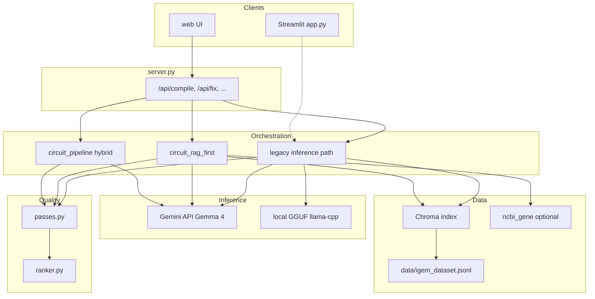

# OpenGeneEdit — Architecture summary

**OpenGeneEdit** (repo tag: `DGENE_*`) turns natural-language design briefs into ranked DNA construct candidates, with reasoning traces, iGEM-registry grounding, heuristic quality passes, and export-oriented outputs. This document outlines the system architecture at a high level.

---

## 1. Layers (top to data)

| Layer | What runs here |
|--------|----------------|
| **Clients** | **Primary:** static web UI (`web/`) served by `server.py`, calling `/api/*`. **Alternate:** `app.py` (Streamlit) — legacy demo path only; does not run the full hybrid compilers. |
| **HTTP server** | `server.py`: `ThreadingHTTPServer`, serves `web/`, orchestrates compile jobs (sync or async with polling). |
| **Orchestration** | Compile modes branch in `_compile` / pipeline modules: hybrid (`circuit_pipeline`), RAG-first only (`circuit_rag_first`), or legacy raw generation (`inference`). |
| **Inference** | `inference.py`: **hosted Gemma 4** (Google Generative Language API) and/or **local GGUF** (`llama-cpp-python`). Parsing of model output into thought + DNA channels. |
| **Domain compilers** | Boolean circuit IR → deterministic synth + verify (`circuit_*`, `slot_template_compile`). Menu + tool-augmented registry assembly (`circuit_rag_first`, `igem_rag`). |
| **Quality & ordering** | `passes.py` (ORF, GC, repeats, Type IIS, CAI, etc.), `ranker.py` (objectives, Pareto), optional `expert_review.py` / `design_expert_lint.py`. |
| **Retrieval & corpora** | `igem_rag.py` (Chroma over `data/igem_dataset.jsonl`), optional `ncbi_gene.py`; offline tooling under **`scripts/`**. |

---

## 2. Request flow (typical web compile)

1. Browser **POST `/api/compile`** with prompt, variant count, optional `progress`.
2. Server selects **compile mode** (`DGENE_COMPILE_MODE`: `circuit_synth` | `rag_first` | `legacy`).
3. For each candidate path, the system produces **(reasoning, DNA)** and metadata (`rag`, `pipeline` tier, verification when applicable).
4. **Legacy-only:** post-hoc **`apply_rag_substitution`** may replace sequence chunks using retrieval. **Hybrid / RAG-first paths** assemble from registry-aware steps and skip that substitution.
5. **Passes** run → **scores** attached → **Pareto ranking** → JSON response (optional **snapshot** id under `.design_snapshots/`).
6. With **`progress: true`**, client polls **`GET /api/compile/status`**; responses may include **`partial`** results until all variants finish.

**Related APIs:** `/api/health` (backend probe), `/api/fix` (constrained recompile + merge), `/api/snapshot` (replay saved design JSON).

---

## 3. Compile modes (architectural branches)

| Mode | Idea |
|------|------|
| **`circuit_synth` (default)** | **Intent** (hosted LLM) → **`CircuitSpec`** / IR → **deterministic assembly** from curated parts + iGEM data → **truth-table verification**. At most one verified topology candidate; remaining slots use **RAG-first** variants. |
| **`rag_first`** | No boolean-topology path — **intent JSON** → **part menu** (retrieval) → optional **slot-template** cassette → **menu-constrained compiler** with optional **registry search tools** mid-generation. |
| **`legacy`** | **Direct generation** (same backends) → parse channels → optional **chunk-wise RAG substitution** → passes → rank. |

---

## 4. Major Python modules (responsibility)

- **`server.py`** — HTTP surface, job lifecycle, static files, fix/snapshot endpoints.
- **`inference.py`** — Backend selection, streaming/generate, Gemma tool loop for registry search, GGUF path, output parsing helpers.
- **`circuit_ir.py` / `circuit_intent.py`** — Structured circuit spec and LLM extraction.
- **`circuit_parts.py` / `circuit_synth.py` / `circuit_verify.py`** — Catalog-backed plasmid build and regulatory vs truth-table check.
- **`circuit_pipeline.py`** — Hybrid orchestration: topology candidate + RAG-first filler variants.
- **`circuit_rag_first.py`** — RAG-first-only pipeline (menu, compiler, assembly, iterators).
- **`slot_template_compile.py`** — Deterministic promoter/RBS/CDS/terminator slots for simple gates when intent parses.
- **`igem_rag.py`** — Indexing, retrieval, substitution, menus, LLM-facing registry tool implementation.
- **`ncbi_gene.py`** — Optional Entrez-backed sequences (promoter slots gated by env).
- **`passes.py` / `ranker.py`** — Metrics, composite objectives, Pareto sort, pipeline-tier preference in ordering.
- **`expert_review.py` / `design_expert_lint.py`** — Optional hosted review / catalog rule lint surfaced on candidates.
- **`visualizer.py`** — Plasmid / map rendering support (consumed by UI or tooling as wired).
- **`app.py`** — Streamlit entry (subset of capabilities).

**Tooling (offline):** `scripts/extract_igem_dataset.py`, `scripts/generate_gemma_train.py`, etc., feed corpora and training JSONL outside the hot request path.

---

## 5. Data & persistence (conceptual)

- **`data/igem_dataset.jsonl`** — Filtered iGEM parts (primary RAG corpus).
- **Chroma** — Vector index under `DGENE_CHROMA_PATH` (default `.chroma_igem`).
- **Snapshots** — Optional persisted compile results (`DGENE_SNAPSHOTS`).
- **Caches** — Registry / NCBI caches may live under the Chroma tree per configuration.
- **Runtime** — Environment-driven (`DGENE_*`, API keys, model id); see `.env.example` for the full contract.

---

## 6. External dependencies

- **Google Generative Language API** for hosted Gemma 4 (and tool calls for live registry search in compiler loops).
- **Optional local** `.gguf` via **llama-cpp-python** for air-gapped or low-resource inference (primarily aligned with legacy generation today).
- **Chroma + sentence-transformers** for embeddings; **NCBI Entrez** when enabled.

---

## 7. Diagram (end-to-end, simplified)

For field-level env vars, API tables, and pass IDs, see **`HACKATHON_TECHNICAL.md`**.
